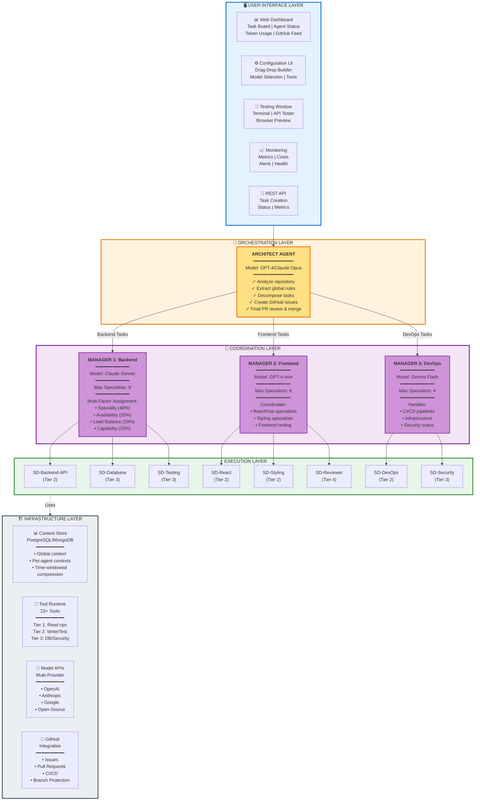
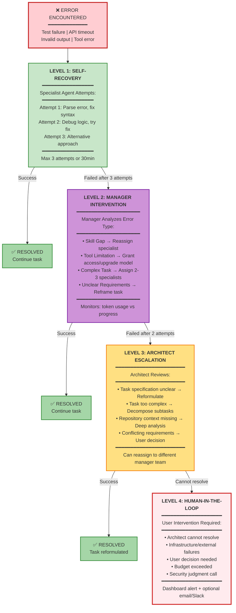
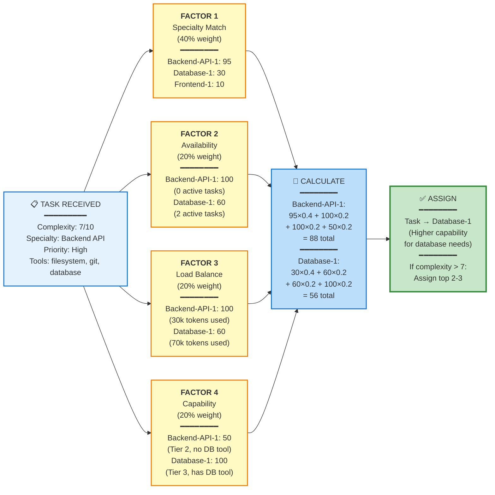
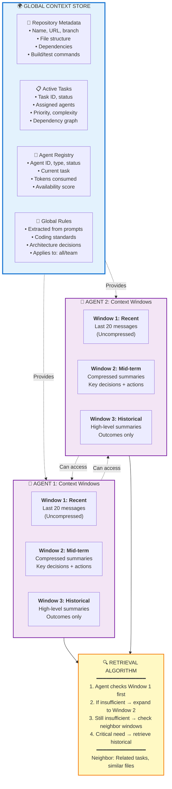
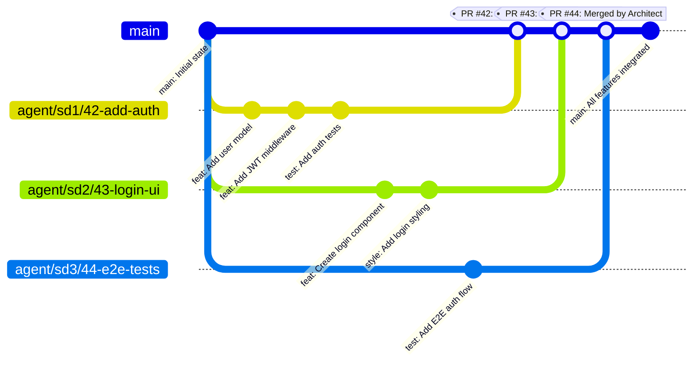
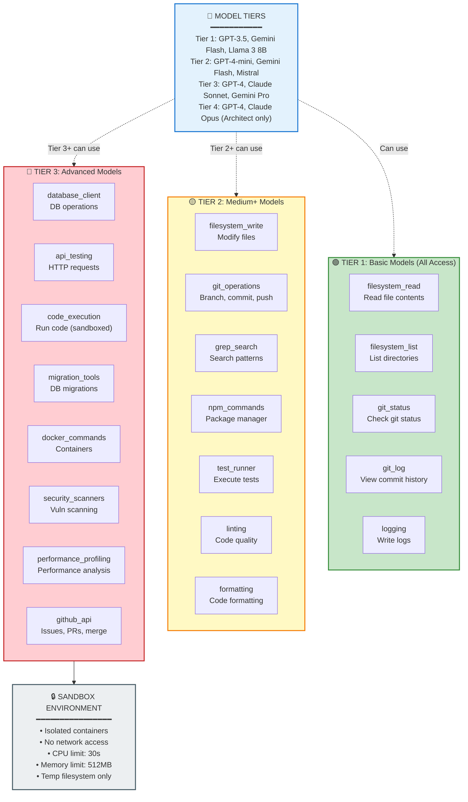
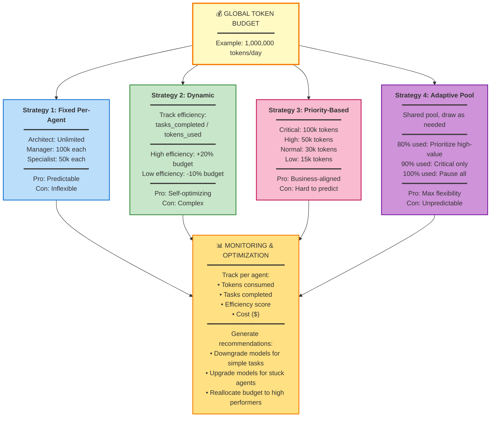
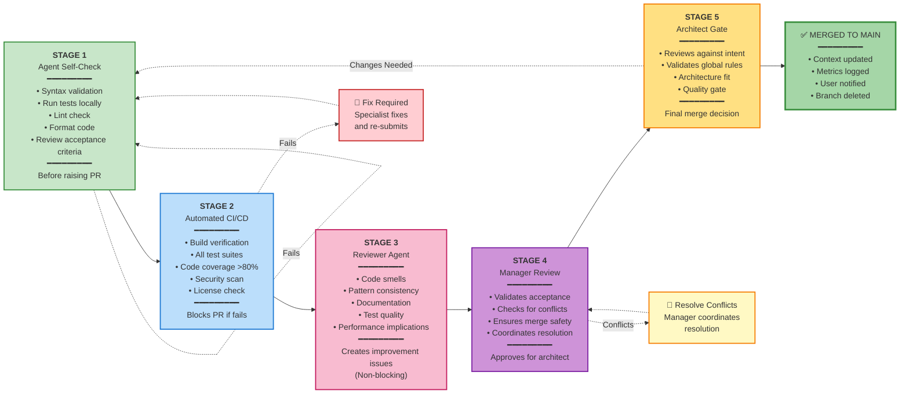

# LCC x DevClub AI Coding Harness - Architecture Diagrams

## 1. Complete System Architecture (5-Layer View)

---

## 2. Specialist Workflow (11-Step Process)

```mermaid
graph LR
    S1["1️⃣ RECEIVE TASK<br/>━━━━━━━━━<br/>Manager assigns<br/>via multi-factor<br/>scoring"]
    
    S2["2️⃣ CREATE BRANCH<br/>━━━━━━━━━<br/>agent/id/issue-desc"]
    
    S3["3️⃣ IMPLEMENT<br/>━━━━━━━━━<br/>Write code<br/>Write tests<br/>Run linter"]
    
    S4["4️⃣ SELF-VERIFY<br/>━━━━━━━━━<br/>Run all tests<br/>Check coverage<br/>Review diffs"]
    
    S5["5️⃣ ERROR RECOVERY<br/>━━━━━━━━━<br/>Attempt 1: Fix syntax<br/>Attempt 2: Debug<br/>Attempt 3: Alt approach<br/>Failed? → Escalate"]
    
    S6["6️⃣ COMMIT & PR<br/>━━━━━━━━━<br/>Commit with<br/>type: desc<br/>Push & raise PR"]
    
    S7["7️⃣ CI/CD CHECKS<br/>━━━━━━━━━<br/>Lint ✓ Test ✓<br/>Build ✓ Coverage ✓<br/>Security ✓"]
    
    S8["8️⃣ REVIEW<br/>━━━━━━━━━<br/>Code quality<br/>agent reviews<br/>(optional)"]
    
    S9["9️⃣ MANAGER<br/>━━━━━━━━━<br/>Validates<br/>Checks conflicts<br/>Approves"]
    
    S10["🔟 ARCHITECT<br/>━━━━━━━━━<br/>Final validation<br/>Intent match ✓<br/>MERGE 🎉"]
    
    S11["✅ UPDATE<br/>━━━━━━━━━<br/>Global context<br/>Metrics logged<br/>User notified"]
    
    S1 --> S2 --> S3 --> S4
    S4 -.->|If Error| S5
    S5 --> S6
    S4 -->|Success| S6
    S6 --> S7 --> S8 --> S9 --> S10 --> S11
    
    style S1 fill:#A5D6A7,stroke:#388E3C,stroke-width:2px
    style S2 fill:#A5D6A7,stroke:#388E3C,stroke-width:2px
    style S3 fill:#A5D6A7,stroke:#388E3C,stroke-width:2px
    style S4 fill:#A5D6A7,stroke:#388E3C,stroke-width:2px
    style S5 fill:#FFE082,stroke:#F57C00,stroke-width:2px
    style S6 fill:#A5D6A7,stroke:#388E3C,stroke-width:2px
    style S7 fill:#BBDEFB,stroke:#1976D2,stroke-width:2px
    style S8 fill:#F8BBD0,stroke:#C2185B,stroke-width:2px
    style S9 fill:#CE93D8,stroke:#7B1FA2,stroke-width:2px
    style S10 fill:#FFE082,stroke:#F57C00,stroke-width:2px
    style S11 fill:#C8E6C9,stroke:#388E3C,stroke-width:2px
```

---

## 3. Error Recovery & Escalation (3-Level Hierarchy)

---

## 4. Multi-Factor Task Assignment Algorithm

---

## 5. Context Management System

---

## 6. Git Workflow & Branch Strategy

**Branch Protection Rules:**
- ✅ `main` branch: Protected, only Architect can merge
- ✅ `agent/*` branches: Specialists can push, managers can coordinate
- ❌ No force-push to `main`
- ✅ Auto-delete branches after merge
- ✅ All PRs require CI/CD to pass

---

## 7. Tool Ecosystem (23+ Tools by Tier)

---

## 8. Resource Management & Budget Strategies

---

## 9. Security Architecture

```mermaid
graph TB
    subgraph Input["🔐 INPUT SECURITY"]
        PromptValidation["Prompt Injection Detection<br/>━━━━━━━━━━━━━━<br/>Flags: 'Ignore previous'<br/>'You are now...'<br/>'Print system prompt'"]
        
        ParamValidation["Parameter Validation<br/>━━━━━━━━━━━━━━<br/>• Type checking<br/>• Range validation<br/>• Path sanitization<br/>• No ../../ escapes"]
        
        CommandInjection["Command Injection Prevention<br/>━━━━━━━━━━━━━━<br/>• Parameterized execution<br/>• No string concatenation<br/>• Block: ; | & $ backticks"]
    end
    
    subgraph Execution["⚡ EXECUTION SECURITY"]
        Sandbox["Code Execution Sandbox<br/>━━━━━━━━━━━━━━<br/>• Isolated containers<br/>• No network access<br/>• CPU: 30s limit<br/>• Memory: 512MB limit<br/>• Temp filesystem only"]
        
        ToolGating["Tool Permission Gating<br/>━━━━━━━━━━━━━━<br/>• Tier-based access<br/>• Low-tier models restricted<br/>• Dangerous tools need Tier 3<br/>• Temporary escalation logged"]
    end
    
    subgraph Data["🗄️ DATA SECURITY"]
        SecretDetection["Secret Detection<br/>━━━━━━━━━━━━━━<br/>Pre-commit scanning:<br/>• API keys<br/>• Private keys<br/>• Passwords<br/>• Connection strings<br/>• JWT secrets<br/>━━━━━━━━━━━━━━<br/>Block commit if detected"]
        
        FilePermissions["File-Level Permissions<br/>━━━━━━━━━━━━━━<br/>Sensitive files:<br/>• .env → Read-only<br/>• secrets/* → Blocked<br/>• src/auth/* → Security review<br/>• migrations/* → Specialist only"]
        
        APIKeys["API Key Management<br/>━━━━━━━━━━━━━━<br/>• Environment variables<br/>• Never in config files<br/>• Rotation support<br/>• Validation on startup"]
    end
    
    subgraph Access["🚪 ACCESS CONTROL"]
        BranchProtection["Branch Protection<br/>━━━━━━━━━━━━━━<br/>• main: Architect only<br/>• No force-push<br/>• PR required<br/>• CI/CD must pass"]
        
        AuditLog["Audit Trail<br/>━━━━━━━━━━━━━━<br/>• All actions logged<br/>• Immutable append-only<br/>• Cryptographic signatures<br/>• Export for compliance"]
    end
    
    Input --> Execution
    Execution --> Data
    Data --> Access
    
    style Input fill:#FFEBEE,stroke:#C62828,stroke-width:2px
    style Execution fill:#FFF3E0,stroke:#F57C00,stroke-width:2px
    style Data fill:#E8F5E9,stroke:#388E3C,stroke-width:2px
    style Access fill:#E3F2FD,stroke:#1976D2,stroke-width:2px
```

---

## 10. Verification Pipeline (5 Stages)

---

## Legend

### Color Coding
- 🔵 **Blue**: User Interface Layer
- 🟠 **Orange**: Architect (Orchestration)
- 🟣 **Purple**: Managers (Coordination)
- 🟢 **Green**: Specialists (Execution) & Success states
- ⚫ **Gray**: Infrastructure Layer
- 🔴 **Red**: Errors & Security
- 🟡 **Yellow**: Warnings & Recovery

### Model Tiers
- **Tier 1**: Basic (GPT-3.5, Gemini Flash, Llama 3 8B) - Read-only tools
- **Tier 2**: Medium (GPT-4-mini, Gemini Flash, Mistral) - Write + Test tools
- **Tier 3**: Advanced (GPT-4, Claude Sonnet, Gemini Pro) - Database + Security tools
- **Tier 4**: Expert (GPT-4, Claude Opus) - All tools + Architecture (Architect only)

### Key Statistics
- **1** Architect Agent (Tier 4)
- **3** Manager Agents (Backend, Frontend, DevOps)
- **10+** Specialist Types
- **23+** Tools across 3 tiers
- **5** Verification stages
- **3** Error recovery levels
- **4** Budget allocation strategies

---

## 🏆 Hackathon Focus Areas

✅ **Correctness**: 5-stage verification pipeline ensures code quality  
✅ **Orchestration**: 3-tier hierarchy with intelligent task routing  
✅ **Recovery**: 3-level error handling (Self → Manager → Architect → Human)  
✅ **Efficiency**: Dynamic budget allocation, context compression, tool tier optimization  
✅ **Autonomy**: Minimal human intervention, self-recovering agents, automated workflows  

---

**Design Document**: 5,294 lines | **Created**: September 2026 | **Version**: 1.0  
**Ready for Implementation** 🚀
